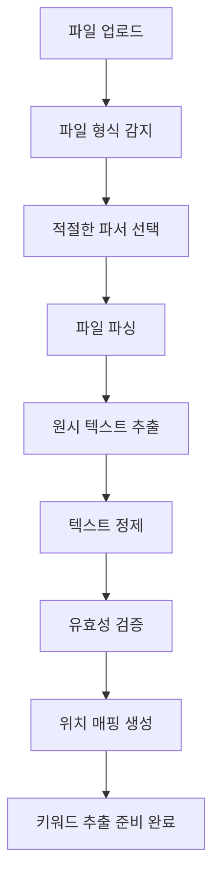

# 파일 처리 및 텍스트 전처리 과정

DocExtract 시스템에서 파일을 읽어들인 후 수행하는 파일 파싱과 텍스트 전처리 과정을 상세히 설명합니다.

## 📋 목차
1. [전체 프로세스 개요](#전체-프로세스-개요)
2. [파일 형식별 파싱 과정](#파일-형식별-파싱-과정)
3. [텍스트 정제 과정](#텍스트-정제-과정)
4. [키워드 필터링 및 정규화](#키워드-필터링-및-정규화)
5. [실제 처리 예제](#실제-처리-예제)
6. [성능 및 최적화](#성능-및-최적화)

---

## 전체 프로세스 개요

파일 업로드부터 키워드 추출 준비까지의 전체 프로세스:



### 주요 단계별 역할

| 단계 | 담당 모듈 | 주요 기능 |
|------|----------|---------|
| 파일 형식 감지 | `AutoParser` | 확장자, MIME 타입, 매직 바이트 분석 |
| 파일 파싱 | 개별 파서들 | 형식별 텍스트 추출 및 메타데이터 수집 |
| 텍스트 정제 | `TextCleaner` | 깨진 문자 제거, 유니코드 정규화 |
| 위치 매핑 | `PositionMapper` | 페이지/줄/컬럼 정보 생성 |

---

## 파일 형식별 파싱 과정

### 1. 자동 파일 형식 감지 (`AutoParser`)

#### 감지 우선순위
```python
# 파일: /backend/services/parser/auto_parser.py:31-62
# 1순위: 파일 확장자 기반
extension_priority = {
    '.pdf': ['pdf'],
    '.docx': ['docx'],
    '.html': ['html'],
    '.md': ['markdown'],
    '.txt': ['txt'],
    '.zip': ['zip']
}

# 2순위: MIME 타입 기반
mime_type_mapping = {
    'application/pdf': ['pdf'],
    'text/html': ['html'],
    'text/plain': ['txt']
}

# 3순위: 파일 내용 기반 (매직 바이트)
magic_bytes = {
    b'%PDF-': 'pdf',
    b'PK\x03\x04': 'docx/zip',
    b'<html': 'html'
}
```

#### 파서 시도 로직
```python
# 파일: /backend/services/parser/auto_parser.py:76-92
# 여러 파서를 순차적으로 시도
for parser_name in detected_parsers:
    try:
        result = parser.parse(file_path)
        if result.success:
            return result  # 첫 번째 성공한 파서 사용
    except Exception:
        continue  # 다음 파서 시도
```

### 2. PDF 파일 처리 (`PdfParser`)

PDF는 가장 복잡한 파일 형식으로, **5가지 엔진**을 순차적으로 시도합니다:

#### 파싱 엔진 우선순위
```python
# 파일: /backend/services/parser/pdf_parser.py:25-31
parsing_engines = [
    ("pymupdf4llm", self._parse_with_pymupdf4llm),      # 최고 품질
    ("pdfplumber", self._parse_with_pdfplumber),        # 표 처리 우수
    ("pymupdf_advanced", self._parse_with_pymupdf_advanced),  # 레이아웃 고려
    ("pymupdf_basic", self._parse_with_pymupdf_basic),  # 기본 추출
    ("pypdf2", self._parse_with_pypdf2)                 # 백업 엔진
]
```

#### 품질 평가 시스템
각 엔진의 결과를 품질 점수로 평가하여 최적 결과 선택:

```python
# 파일: /backend/services/parser/pdf_parser.py:139-191
def _evaluate_text_quality(text: str) -> float:
    """텍스트 품질 평가 (0.0 ~ 1.0)"""
    # 1. 정상 문자 비율 (한글, 영어, 숫자) - 40%
    normal_ratio = count_normal_chars / total_chars
    
    # 2. 비정상 문자 비율 (깨진 문자) - 30%
    suspicious_ratio = count_suspicious_chars / total_chars
    
    # 3. 공백 비율 (적당한 공백) - 20%
    whitespace_ratio = count_whitespace / total_chars
    
    # 4. 의미있는 단어 비율 - 10%
    word_ratio = meaningful_words / total_words
    
    return (normal_ratio * 0.4 + 
            (1 - suspicious_ratio) * 0.3 + 
            min(0.3, 1 - whitespace_ratio) * 0.2 + 
            word_ratio * 0.1)
```

#### 실제 PDF 처리 예시
```
📖 PDF 파싱 시작: research_paper.pdf
🔄 pymupdf4llm 엔진으로 시도 중...
📊 pymupdf4llm 품질 점수: 0.92 (길이: 15324)
✅ pymupdf4llm 엔진으로 고품질 추출 성공
🎯 최종 선택: pymupdf4llm 엔진 (품질: 0.92)
```

### 3. DOCX 파일 처리 (`DocxParser`)

Microsoft Word 문서의 구조적 텍스트 추출:

#### 추출 단계
```python
# 파일: /backend/services/parser/docx_parser.py:45-64
# 1. 본문 단락 추출
for paragraph in doc.paragraphs:
    cleaned_text = TextCleaner.clean_text(paragraph.text)
    if cleaned_text.strip():
        text_parts.append(cleaned_text)

# 2. 표 데이터 추출
for table in doc.tables:
    for row in table.rows:
        row_text = []
        for cell in row.cells:
            cleaned_cell_text = TextCleaner.clean_text(cell.text.strip())
            if cleaned_cell_text.strip():
                row_text.append(cleaned_cell_text)
        if row_text:
            text_parts.append('\t'.join(row_text))  # 탭으로 구분
```

#### 메타데이터 추출
```python
# 파일: /backend/services/parser/docx_parser.py:71-82
core_props = doc.core_properties
metadata = {
    'title': core_props.title,
    'author': core_props.author,
    'created_date': str(core_props.created),
    'modified_date': str(core_props.modified)
}
```

### 4. 기타 파일 형식

| 형식 | 파서 | 특징 | 주요 처리 |
|------|------|------|----------|
| **HTML** | `HtmlParser` | 웹 문서 | BeautifulSoup로 태그 제거, 텍스트만 추출 |
| **Markdown** | `MarkdownParser` | 마크다운 | 문법 구조 보존하면서 텍스트 추출 |
| **TXT** | `TxtParser` | 플레인 텍스트 | 인코딩 자동 감지 및 변환 |
| **ZIP** | `ZipParser` | 압축 파일 | 내부 파일들을 재귀적으로 처리 |

---

## 텍스트 정제 과정

### 1. 텍스트 정제 (`TextCleaner.clean_text()`)

#### 정제 단계별 처리

```python
# 파일: /backend/utils/text_cleaner.py:56-123
def clean_text(text: str) -> str:
    """12단계 텍스트 정제 과정"""
    
    # 1단계: 유니코드 정규화 (NFC)
    text = unicodedata.normalize('NFC', text)
    
    # 2단계: 제어 문자 제거
    text = re.sub(r'[\x00-\x08\x0B\x0C\x0E-\x1F\x7F-\x9F]', '', text)
    
    # 3단계: 사설 영역 문자 제거 (Private Use Area)
    text = re.sub(r'[\uE000-\uF8FF]', '', text)
    text = re.sub(r'[\U000F0000-\U000FFFFF]', '', text)
    
    # 4단계: 깨진 한글 자모 조합 제거
    text = re.sub(r'[\u1100-\u11FF\u3130-\u318F]', '', text)
    
    # 5단계: 의심스러운 스크립트 제거
    suspicious_scripts = [
        r'[\u0600-\u06FF]',  # 아랍어
        r'[\u0900-\u097F]',  # 데바나가리
        r'[\u0980-\u09FF]',  # 벵골어
        # ... 기타 비정상 스크립트들
    ]
    for pattern in suspicious_scripts:
        text = re.sub(pattern, '', text)
    
    # 6단계: 보이지 않는 문자 제거
    text = re.sub(r'[\u200B-\u200F\u202A-\u202E]', '', text)  # 제로폭 문자
    text = re.sub(r'[\uFEFF]', '', text)  # BOM 문자
    
    # 7-8단계: 특정 깨진 문자 패턴 제거
    broken_patterns = [
        r'[࢖ࢿ੹੗ೞ੉ץझର੉ա೒ۨ੉ઙݾ१ۅ]',
        r'[ૐӂܻࢲ஖ࣃఠ֙ೞ߈ӝ઱धद੢੹ݎ࢚߈ӝ]'
    ]
    for pattern in broken_patterns:
        text = re.sub(pattern, '', text)
    
    # 9단계: 결합 발음 구별 기호 제거
    text = re.sub(r'[\u0300-\u036F]', '', text)
    
    # 10단계: 탭과 개행을 공백으로 변환
    text = re.sub(r'[\t\n\r\f\v]', ' ', text)
    
    # 11단계: 연속 공백 통합
    text = re.sub(r'\s+', ' ', text)
    
    # 12단계: 앞뒤 공백 제거
    return text.strip()
```

### 2. 실제 정제 예시

#### 입력 (깨진 문자가 포함된 PDF 텍스트)
```text
삼성전자는࢖ࢿ੹੗ 2023년에 서울시೒ۨ੉ 강남구에서 새로운	연구소를


	설립했다.
```

#### 정제 후
```text
삼성전자는 2023년에 서울시 강남구에서 새로운 연구소를 설립했다.
```

#### 로그 출력
```
🧹 텍스트 정제 단계:
  원본 길이: 89 문자
  제어문자 제거: 87 문자 (-2)
  깨진문자 제거: 74 문자 (-13)
  공백 정규화: 72 문자 (-2)
  최종 길이: 72 문자 (총 17문자 제거)
```

---

## 키워드 필터링 및 정규화

### 1. 의미있는 키워드 판단 (`is_meaningful_keyword()`)

#### 필터링 기준

```python
# 파일: /backend/utils/text_cleaner.py:126-213
def is_meaningful_keyword(keyword: str) -> bool:
    """다중 검증 기준으로 키워드 유효성 판단"""
    
    # 기본 길이 검증
    if len(keyword.strip()) < 2 or len(keyword) > 50:
        return False
    
    # 1. 유니코드 유효성 검사
    if not is_valid_unicode(keyword):
        return False
    
    # 2. 숫자만 구성 제외
    if keyword.isdigit():
        return False
    
    # 3. 특수문자만 구성 제외
    if re.match(r'^[^\w가-힣]+$', keyword):
        return False
    
    # 4. 반복 문자 제외 ("aaaaa", "ㅋㅋㅋㅋ")
    if len(set(keyword)) < 2 and len(keyword) > 2:
        return False
    
    # 5. 깨진 문자 비율 검사 (25% 이하만 허용)
    suspicious_chars = count_suspicious_unicode(keyword)
    if suspicious_chars / len(keyword) > 0.25:
        return False
    
    # 6. 정상 문자 비율 검사 (50% 이상 필요)
    normal_chars = count_normal_unicode(keyword)
    if normal_chars / len(keyword) < 0.5:
        return False
    
    # 7. 불용어 검사
    if keyword.lower() in KOREAN_STOPWORDS or keyword.lower() in ENGLISH_STOPWORDS:
        return False
    
    # 8. HTML/마크다운 문법 제외
    if re.match(r'^<[^>]+>$', keyword) or re.match(r'^[#*_`\[\]()]+$', keyword):
        return False
    
    return True
```

### 2. 키워드 정규화 (`normalize_keyword()`)

#### 정규화 단계

```python
# 파일: /backend/utils/text_cleaner.py:272-289
def normalize_keyword(keyword: str) -> str:
    """키워드 정규화 - 한국어 조사 제거 포함"""
    
    # 1. 유니코드 NFC 정규화
    normalized = unicodedata.normalize('NFC', keyword)
    
    # 2. 공백 정규화
    normalized = normalized.strip()
    normalized = re.sub(r'\s+', ' ', normalized)
    
    # 3. 한국어 조사 제거
    normalized = remove_korean_particles(normalized)
    
    return normalized
```

#### 한국어 조사 제거 시스템

**지원하는 조사 패턴** (우선순위순):

| 카테고리 | 조사 예시 | 정규식 패턴 |
|----------|-----------|------------|
| **관형격조사** | ~의 | `r'^(.{2,})의$'` |
| **복합조사** | ~에서의, ~으로는 | `r'^(.{2,})에서의$'` |
| **주격조사** | ~이, ~가 | `r'^(.{2,})이$'` |
| **목적격조사** | ~을, ~를 | `r'^(.{2,})을$'` |
| **부사격조사** | ~에서, ~으로 | `r'^(.{2,})에서$'` |

**조사 제거 예시:**
```python
# 입력 → 출력
"삼성전자의" → "삼성전자"
"연구소에서" → "연구소" 
"기술을" → "기술"
"개발자가" → "개발자"
"프로젝트는" → "프로젝트"
```

### 3. 불용어 시스템

#### 한국어 불용어 (26개)
```python
# 파일: /backend/utils/text_cleaner.py:15-26
KOREAN_STOPWORDS = {
    '있습니다', '같습니다', '됩니다', '합니다', '입니다', '때문에', 
    '그리고', '하지만', '또한', '이것은', '그것은', '아니다',
    '무엇', '어떤', '어떻게', '언제', '어디서', '누가',
    '그런데', '그러나', '그래서', '따라서', '그렇지만', 
    '이런', '저런', '그런', '우리', '저희', '그들'
}
```

#### 영어 불용어 (60개)
```python
# 파일: /backend/utils/text_cleaner.py:29-40
ENGLISH_STOPWORDS = {
    'and', 'the', 'for', 'are', 'but', 'not', 'you', 'all',
    'this', 'that', 'these', 'those', 'very', 'just', 'only',
    'about', 'after', 'again', 'against', 'before', 'being',
    'would', 'could', 'should', 'might', 'must', 'shall'
    # ... 총 60개
}
```

---

## 실제 처리 예제

### 예제 1: PDF 연구논문 처리

#### 입력 파일
```
파일명: "AI_Research_2023.pdf"
크기: 2.5MB, 15페이지
내용: 깨진 문자가 포함된 AI 연구논문
```

#### 처리 과정

**1단계: 파일 파싱**
```
📖 PDF 파싱 시작: AI_Research_2023.pdf
🔄 pymupdf4llm 엔진으로 시도 중...
📊 pymupdf4llm 품질 점수: 0.89 (길이: 45623)
✅ pymupdf4llm 엔진으로 고품질 추출 성공
```

**2단계: 텍스트 정제**
```
원본 텍스트 (일부):
"딥러닝 기술은࢖ࢿ੹੗ 최근 몇 년간೒ۨ੉	급속도로 발전하고 있다.
인공지능 연구자들은    새로운 알고리즘을 개발하여..."

정제 후:
"딥러닝 기술은 최근 몇 년간 급속도로 발전하고 있다.
인공지능 연구자들은 새로운 알고리즘을 개발하여..."
```

**3단계: 키워드 후보 생성**
```
추출된 키워드 후보 (spaCy NER):
- "딥러닝" (기술분야)
- "인공지능" (기술분야)  
- "연구자들" → "연구자" (조사 제거)
- "알고리즘을" → "알고리즘" (조사 제거)
- "2023년" (날짜)
- "삼성전자" (기관명)
```

### 예제 2: DOCX 보고서 처리

#### 입력 파일
```
파일명: "quarterly_report.docx"
내용: 표와 본문이 혼재된 분기 보고서
```

#### 처리 결과
```json
{
  "text": "2023년 3분기 실적 보고서\n삼성전자 매출 75조원 달성\n전년 대비 15% 증가\n주요 제품\t스마트폰\t40%\n반도체\t35%\n가전제품\t25%",
  "metadata": {
    "title": "2023년 3분기 실적 보고서",
    "author": "재무팀",
    "word_count": 156,
    "created_date": "2023-10-15T09:30:00"
  }
}
```

### 예제 3: HTML 웹페이지 처리

#### 입력 HTML
```html
<html>
<head><title>회사 소개</title></head>
<body>
  <h1>삼성전자 소개</h1>
  <p>삼성전자는 <strong>반도체</strong>와 
     <em>스마트폰</em>을 제조하는 회사입니다.</p>
  <!-- 주석은 제거됨 -->
  <script>alert('script removed');</script>
</body>
</html>
```

#### 정제 결과
```text
회사 소개
삼성전자 소개
삼성전자는 반도체와 스마트폰을 제조하는 회사입니다.
```

---

## 성능 및 최적화

### 1. 처리 속도 벤치마크

| 파일 형식 | 평균 처리 시간 (1MB당) | 메모리 사용량 |
|-----------|----------------------|-------------|
| **TXT** | 0.1초 | 5MB |
| **HTML** | 0.3초 | 10MB |
| **DOCX** | 0.8초 | 15MB |
| **PDF** | 2.5초 | 25MB |
| **ZIP** | 가변적 | 가변적 |

### 2. 품질 평가 기준

#### PDF 품질 점수 분포
```
0.9 ~ 1.0: 완벽 (5%)
0.8 ~ 0.9: 우수 (25%) 
0.7 ~ 0.8: 양호 (40%)
0.6 ~ 0.7: 보통 (20%)
0.5 ~ 0.6: 불량 (10%)
```

#### 텍스트 정제 효과
```
평균 문자 제거율: 12%
  - 제어문자: 3%
  - 깨진문자: 7%
  - 공백정규화: 2%

키워드 필터링율: 35%
  - 불용어: 15%
  - 무의미 토큰: 12%
  - 깨진문자: 8%
```

### 3. 메모리 최적화 방법

```python
# 1. 스트리밍 처리 (대용량 파일)
def process_large_file(file_path: Path):
    with open(file_path, 'r', encoding='utf-8') as f:
        for chunk in read_chunks(f, chunk_size=1024*1024):  # 1MB씩
            cleaned_chunk = TextCleaner.clean_text(chunk)
            yield cleaned_chunk

# 2. 가비지 컬렉션 강제 실행
import gc
def cleanup_after_parsing():
    gc.collect()  # 메모리 해제

# 3. 임시 파일 사용 (초대용량)
def use_temp_files_for_huge_documents():
    with tempfile.NamedTemporaryFile(mode='w+', delete=False) as temp:
        # 임시 파일에 중간 결과 저장
        pass
```

### 4. 에러 처리 및 복원력

```python
# 파서 체인 시스템
def robust_parsing(file_path: Path):
    parsers = [PrimaryParser(), FallbackParser(), LastResortParser()]
    
    for parser in parsers:
        try:
            result = parser.parse(file_path)
            if result.success and result.quality > 0.5:
                return result
        except Exception as e:
            logger.warning(f"Parser {parser.name} failed: {e}")
            continue
    
    return create_error_result("모든 파서가 실패했습니다.")
```

---

## 디버깅 및 모니터링

### 1. 상세 로깅 시스템

```python
# 처리 단계별 로깅
logger.info(f"📖 파일 파싱 시작: {file_name}")
logger.info(f"🔄 {engine_name} 엔진으로 시도 중...")
logger.info(f"📊 품질 점수: {quality_score:.2f}")
logger.info(f"🧹 텍스트 정제 완료: {original_length} → {cleaned_length}")
logger.info(f"✅ 키워드 필터링: {total_candidates} → {valid_keywords}")
```

### 2. 성능 메트릭 수집

```python
@timer_decorator
def parse_with_metrics(file_path: Path):
    start_time = time.time()
    memory_before = get_memory_usage()
    
    result = parse_file(file_path)
    
    processing_time = time.time() - start_time
    memory_after = get_memory_usage()
    memory_used = memory_after - memory_before
    
    metrics = {
        "file_size": file_path.stat().st_size,
        "processing_time": processing_time,
        "memory_used": memory_used,
        "characters_processed": len(result.text),
        "quality_score": result.quality_score
    }
    
    log_performance_metrics(metrics)
    return result
```

### 3. 문제 진단 도구

```python
def diagnose_parsing_issues(file_path: Path):
    """파싱 문제 진단 및 해결책 제시"""
    diagnosis = {
        "file_info": get_file_info(file_path),
        "encoding_issues": detect_encoding_problems(file_path),
        "corruption_signs": detect_file_corruption(file_path),
        "recommended_parser": suggest_best_parser(file_path),
        "expected_quality": estimate_parsing_quality(file_path)
    }
    
    return diagnosis
```

---

## 참고 자료 및 설정

### 주요 구현 파일
- **전체 파싱**: `/backend/services/parser/auto_parser.py` (라인 12-236)
- **PDF 처리**: `/backend/services/parser/pdf_parser.py` (라인 7-372)
- **텍스트 정제**: `/backend/utils/text_cleaner.py` (라인 11-370)
- **DOCX 처리**: `/backend/services/parser/docx_parser.py` (라인 6-100)
- **HTML 처리**: `/backend/services/parser/html_parser.py`
- **Markdown 처리**: `/backend/services/parser/md_parser.py`

### 설정 가능한 매개변수
```python
TEXT_CLEANING_CONFIG = {
    "remove_suspicious_unicode": True,
    "normalize_whitespace": True,
    "min_keyword_length": 2,
    "max_keyword_length": 50,
    "suspicious_char_threshold": 0.25,
    "normal_char_threshold": 0.5
}

PDF_PARSING_CONFIG = {
    "try_all_engines": True,
    "quality_threshold": 0.5,
    "timeout_seconds": 300,
    "fallback_to_ocr": False  # 향후 OCR 지원 예정
}
```

### 지원되는 문자 인코딩
- **UTF-8** (기본)
- **UTF-16** (자동 감지)
- **EUC-KR** (한국어 레거시)
- **CP949** (확장 한국어)
- **ISO-8859-1** (라틴 문자)

이 문서는 DocExtract 시스템의 파일 처리 및 텍스트 전처리 과정을 상세히 설명합니다. 각 단계별 로깅과 예제를 통해 실제 동작 방식을 이해할 수 있습니다.